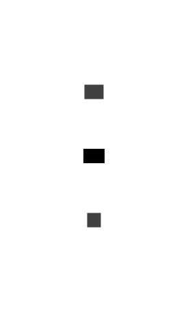

# cdor

Write Go+/Go code to make diagrams.

## cdor vs [d2](https://d2lang.com)

`cdor` is inspired and pwored by `d2`, the difference is:

> d2 is a `DSL` (Domain Specific Language), But cdor is `SDF` (Specific Domain Friendliness), we just write Go+/Go to generate diagrams.

## examples


```c
cons(
	con("Go+", "Go", opt.label("cdor")),
)
```

<center></center>

see more in [example_test.go](example_test.go).

## TODO

- [x] Go+ classfile
- [ ] arrorw options
- [ ] config api
- [ ] special shapes
